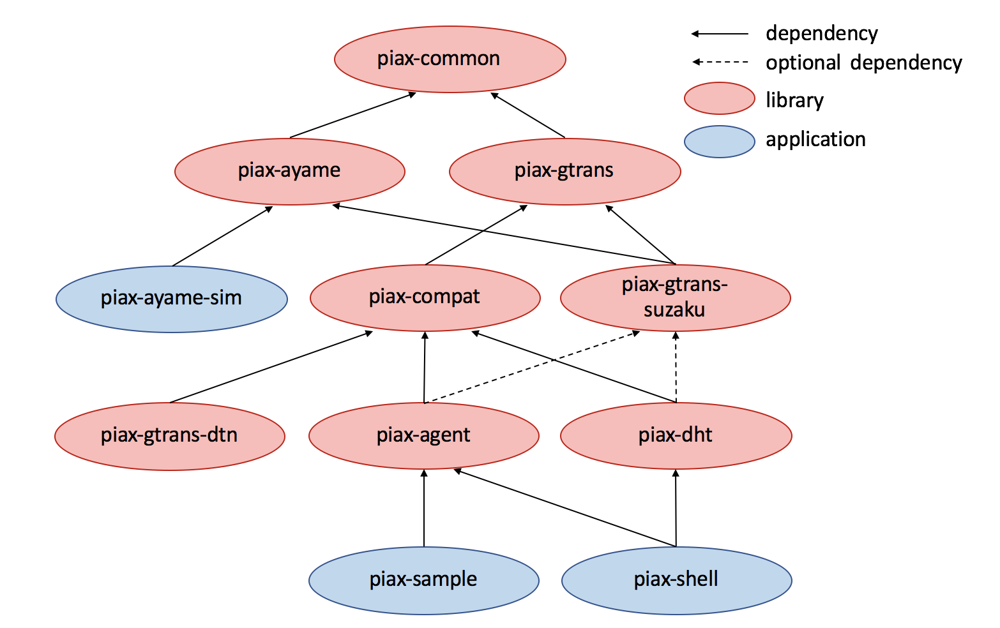

# What is PIAX?

PIAX is a middleware for P2P distributed computing.
By using PIAX core transport mechanism, you can write programs that utilize discovery features of overlays.
PIAX also provides a mobile agent-based programming framework. You can write distributed programs that interact each other by using remote procedure calls among mobile agents.

# Structure of the software

The structure of PIAX is as follows:

* 'piax-common' - The common modules of PIAX.
* 'piax-ayame' - Ayame framework.
* 'piax-ayame-sim' - Ayame simulator.
* 'piax-gtrans' - GTrans framework.
* 'piax-gtrans-suzaku' - Suzaku overlay.
* 'piax-agent' - PIAX Agent modules.
* 'piax-compat' - PIAX modules for compatibilities.
* 'piax-gtrans-dtn' - Modules related to DTN, AdHoc and Bluetooth (experimental).
* 'piax-dht' - A DHT implementation on PIAX.
* 'piax-samples' - Some simple samples of GTrans and PIAX Agents.
* 'piax-shell' - A command-line application to demonstrate PIAX Agents.

# Build from sources

cd into cloned source directory and `mvn -Dmaven.test.skip=true clean package`. 
Of course you can do tests by eliminating `-Dmaven.test.skip=true` (it takes a while).

# Maven build settings

PIAX artifacts are available on Maven Central Repository. You can build your program using maven by following settings.

PIAX GTrans:

     <!-- https://mvnrepository.com/artifact/org.piax/piax-gtrans -->
     <dependency>
        <groupId>org.piax</groupId>
        <artifactId>piax-gtrans</artifactId>
        <version>3.1.0</version>
     </dependency>

PIAX Agent:

     <!-- https://mvnrepository.com/artifact/org.piax/piax-agent -->
     <dependency>
        <groupId>org.piax</groupId>
        <artifactId>piax-agent</artifactId>
        <version>3.1.0</version>
     </dependency>
